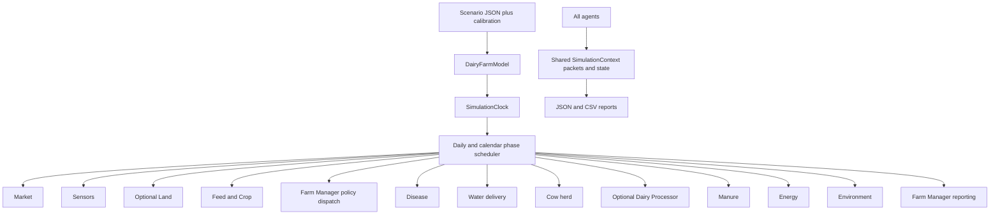

# Dairy ABM Project Explanation

## 1. What this project is

This repository is a **zero-dependency Python agent-based model (ABM) of a dairy farm**. It simulates a herd and its surrounding farm systems over time, one day at a time.

The model is designed to explore how biological, operational, environmental, and economic decisions interact. A run can produce information about:

- Milk production and milk composition
- Feed intake, feed sourcing, and feed cost
- Cow health, reproduction, heat stress, rumen conditions, and mortality
- Disease spread and treatment economics
- Manure collection, storage, composting, digestion, and emissions
- Biogas, electricity, heat, solar, and energy value
- Water use, wastewater treatment, recycling, and irrigation
- Greenhouse-gas emissions and avoided emissions
- Soil nutrients, fertilizer substitution, soil-carbon context, and circularity
- Dairy processing into products such as cheese, butter, yogurt, fresh milk, and functional products
- Farm revenue, operating costs, cash balance, profit, investments, ROI, and recommendations
- Genetics, breeding candidates, genetic merit, and annual genetic gain
- Optional land management, seasonal availability, grazing context, and tree-cover/soil context

The project is primarily a **research, policy-analysis, and education simulation framework**. It is not yet a validated scientific or financial forecasting product: many values in the calibration file are explicitly marked as implementation assumptions and require domain-specific calibration before real-world decisions are based on them.

## 2. Technology and dependencies

The runtime is written in Python and uses only the standard library. The package is intended for Python 3.10 or newer.

Important standard-library components include:

- `argparse` for the command-line interface
- `json` and `csv` for configuration and report files
- `datetime` for the simulation calendar
- `random.Random` for seeded, reproducible stochastic behavior
- `dataclasses` and type annotations for shared runtime structures
- `unittest` for the Python test suite

Bun is used only as a repository-level test wrapper. It launches the Python `unittest` suite from `tests/python_unittest.test.ts`; Bun is not part of the simulation runtime.

## 3. Repository structure

```text
research-agents/
├── README.md                         User-facing project documentation
├── explanation.md                    This project explanation
├── AGENTS.md                         Repository instructions for coding agents
├── LICENSE                           MIT license
├── package.json                      Bun test script
├── configs/
│   └── calibration.json              Versioned calibration/default parameter values
├── scenarios/
│   └── baseline.json                 10-day example scenario
├── dairy_abm/
│   ├── __init__.py                   Public package entry point
│   ├── __main__.py                   Enables `python3 -m dairy_abm`
│   ├── cli.py                        Command-line commands and overrides
│   ├── config.py                     Calibration loading, merging, and validation
│   ├── core.py                       Packets, events, context, clock, and utilities
│   ├── model.py                      Top-level model and scheduler
│   ├── reports.py                    JSON/CSV report generation
│   └── agents/
│       ├── cow_agent.py
│       ├── dairy_processor_agent.py
│       ├── disease_agent.py
│       ├── energy_agent.py
│       ├── environment_agent.py
│       ├── farm_manager_agent.py
│       ├── feed_crop_agent.py
│       ├── genetics_agent.py
│       ├── land_agent.py
│       ├── manure_agent.py
│       ├── market_agent.py
│       ├── sensors_agent.py
│       └── water_agent.py
├── docs/
│   ├── plan.md                       Implementation roadmap and completion history
│   └── calibration_review.md         Assumption and scientific-calibration checklist
└── tests/
    ├── python_unittest.test.ts       Bun wrapper around Python unittest
    └── test_*.py                     Unit, integration, and contract tests
```

The repository also contains local development/cache directories such as `node_modules/` and `.pytest_cache/`. They are ignored by Git and are not part of the application design.

## 4. High-level architecture

The model is organized around independent agents. Agents do not normally call one another directly. Instead, each agent publishes a `Packet` into a shared `SimulationContext`, and downstream agents read the packets they need.



### Shared runtime objects (`dairy_abm/core.py`)

- **`Packet`** is the main data-exchange object. It includes a source, packet name, simulation date, payload, quality, period, confidence, and optional stream ID.
- **`SimulationContext`** stores the scenario, calibration, seeded random generator, event log, latest packets, persistent state, and report records.
- **`EventLog`** collects structured events and warnings that are included in `summary.json`.
- **`SimulationClock`** produces simulation dates and identifies Sundays, calendar month ends, and December 31.
- **`BaseAgent`** defines the common daily, weekly, monthly, and annual hooks.
- Shared helpers provide JSON/CSV writing, deep dictionary merging, nonnegative-value validation, and fraction validation.

The context also holds persistent state for circular-loop credits, nutrient credits, effective policy, policy history, agent histories, and the environmental ledger.

## 5. Agent responsibilities

The current runtime has 13 agent modules. Twelve are part of the normal system; Land Management is optional and is instantiated only when enabled.

| Agent | Main responsibility |
|---|---|
| **Market** | Supplies milk, feed, electricity, cull, product, and other price signals. Supports static prices, observed CSV prices, and observed prices with stochastic shocks. |
| **Sensors** | Produces observations such as weather/THI, DMI, rumen pH, SARA state, estrus detection, NIR feed quality, mastitis alerts, and sensor-confidence metadata. |
| **Land Management** | Optional. Provides seasonal cropland/pasture availability, grazing access, paddock/land context, tree-cover context, and soil-carbon context. |
| **Feed/Crop** | Produces feed rations, crop output, feed inventory changes, feed sourcing, irrigation demand, nutrient values, crude protein, metabolizable protein, nitrogen flows, leaching, and feed cost. It consumes eligible lagged circular credits. |
| **Farm Manager policy dispatch** | Applies policy and operational decisions before disease and cow production. It publishes effective policy context used by downstream agents. |
| **Disease** | Models disease compartments and disease economics. It supports outbreak seeding, transmission, recovery, quarantine, biosecurity, vaccination, immunity, inherited resistance, and stress susceptibility. |
| **Water delivery** | Prepares drinking/parlor water before cows act, then performs treatment, recovery, reuse, storage, nutrient recovery, and water-cost accounting. |
| **Cow** | Simulates individual cow state and herd output: age, parity, days in milk, body condition, body weight, DMI, milk, manure, enteric methane, rumen pH/SARA, heat stress, reproduction, pregnancy, calving, mortality, traits, and NUE. |
| **Dairy Processor** | Optional processing of milk into product streams. Tracks product mix, product revenue, whey/scotta/sludge/waste-milk residuals, processing energy, capacity, and byproduct routes. |
| **Manure** | Splits manure into digester, compost, and storage routes; tracks collection, overflow, persistent storage, N/P/K, methane/N2O-related flows, co-feed, thermochemical paths, and nutrient returns. |
| **Energy** | Converts eligible biogas and thermochemical inputs into energy using CHP, electricity, or boiler modes. It also models solar, parasitic load, demand capping, grid displacement, heat, self-sufficiency, and energy value. |
| **Environment** | Maintains the stream-level greenhouse-gas ledger, including positive emissions and avoided emissions. Reports net carbon, intensity, circularity, soil/fertilizer metrics, sustainability, and cumulative/monthly KPIs. |
| **Farm Manager reporting** | Combines revenue, feed and operating costs, disease costs, cooling/processing energy costs, energy value, carbon credits, cash balance, profit, policy conflicts, recommendations, investments, ROI, and payback. |
| **Genetics** | Records daily intake quality, calculates merit and eligibility, selects parents, creates prospective offspring trait vectors, and produces annual breeding/genetic-gain reports. |

## 6. Daily execution order

Execution order is intentionally fixed because the agents have biological and operational dependencies. The current daily sequence is:

```text
1.  Market publishes prices and market context.
2.  Sensors publish environmental and animal observations.
3.  Land publishes optional land/grazing context.
4.  Feed/Crop prepares the ration and crop/feed signals.
5.  Farm Manager dispatches policy before production.
6.  Disease updates disease state and case effects.
7.  Water prepares pre-production water delivery.
8.  Cow simulates herd and per-cow production.
9.  Dairy Processor handles optional processing.
10. Manure routes manure and creates nutrient/energy inputs.
11. Energy converts eligible feedstock.
12. Water completes treatment and water-balance accounting.
13. Environment records emissions, offsets, and circularity.
14. Farm Manager records financial and management results.
15. Genetics records daily intake for later annual selection.
```

The model then records the daily report. On appropriate calendar boundaries:

- **Weekly** hooks run on Sundays.
- **Monthly** hooks run after the daily record on the last calendar day of each month.
- **Annual** hooks run on December 31 after the monthly phase; Genetics and Farm Manager produce annual records.

The scheduler preserves a deliberate compatibility boundary: the chosen daily order does not introduce same-day `Cow -> Feed/Crop` feedback. This is why some circular effects are represented as next-day credits.

## 7. Circular-economy loops

The model represents four circular loops explicitly:

- **L1 nutrient/manure loop:** compost-derived feed credit becomes available to Feed/Crop on the following day.
- **L2 water loop:** recovered-water credit offsets following-day irrigation demand.
- **L3 energy loop:** biogas generation is gated by the energy-loop switch. It is intentionally self-contained and does not alter Feed/Crop mass inputs.
- **L4 dairy-byproduct loop:** whey-derived feed credit becomes available the next day when processor and whey processing are active.

The one-day delay is intentional. It prevents same-day feedback and preserves the fixed scheduler order. Credits are persistent in `SimulationContext`, consumed once by Feed/Crop, and reported in daily records.

## 8. Configuration and calibration

### Scenario configuration

A scenario is a JSON object describing one simulation experiment. Common fields include:

- `name`, `start_date`, `days`, and `seed`
- `herd_size` or explicit `herd` definitions
- cropland and pasture size
- processor, whey, and Land enablement flags
- L1-L4 loop switches
- market mode and optional observed market CSV
- disease outbreak, biosecurity, and vaccination settings
- amino-acid policy and catch-crop settings
- energy conversion mode and solar capacity
- land seasonal availability and grazing flags
- policy updates, cash balance, and investment schedules

The example in `scenarios/baseline.json` runs a 100-cow, 10-day simulation beginning December 25, 2026. Processor and Land are disabled by default; the four circular loops are enabled.

### Calibration configuration

`configs/calibration.json` contains the model's parameter registry. It is organized into these sections:

- `genetics`
- `cow`
- `feed_crop`
- `manure`
- `energy`
- `disease`
- `environment`
- `farm_manager`
- `sensors`
- `water`
- `dairy_processor`
- `market`
- `land`
- `runtime`

Every leaf calibration entry carries metadata such as:

```json
{
  "value": 0.35,
  "unit": "fraction",
  "valid_range": "0.26..0.43",
  "source": "abm_blueprint.html",
  "assumption": false,
  "description": "..."
}
```

The config loader supports deep-merging an optional calibration override on top of the default file. Validation checks inventory presence, metadata types, trait-weight totals, manure-route totals, circularity-weight totals, product-mix totals, and bounded residual route fractions. Invalid processor/whey and Land scenario combinations are rejected during model construction rather than silently ignored.

The current calibration inventory exposes **196 parameter entries**. `docs/calibration_review.md` identifies which values are assumptions and which are anchored to the project blueprint. Assumption-marked values should be reviewed against real farm, biological, environmental, and market data before scientific or financial use.

## 9. Market modes

The Market agent supports three modes:

1. **`static`**: uses calibration defaults.
2. **`observed`**: reads prices from a CSV.
3. **`observed_plus_shock`**: reads observed prices and applies seeded stochastic shocks.

Observed CSVs can be selected by daily date, year/month or period, or annual frequency. Missing numeric fields are carried forward from the last valid value and marked with lower packet quality/confidence. This lets reports distinguish directly observed values from estimated or carried-forward values.

Product-specific fields such as `price_per_l_milk_cheese` flow to the processor without silently converting unrelated wholesale price series into a different unit.

## 10. Outputs

The CLI writes six files into the requested output directory:

| File | Purpose |
|---|---|
| `summary.json` | Scenario metadata, report contract, active flags, effective policy, events, and latest packets. |
| `calibration_inventory.json` | Flattened machine-readable list of calibration values and metadata. |
| `daily.csv` | Daily operational, biological, resource, environmental, economic, processor, and confidence fields. |
| `schedule.csv` | Date, phase, and execution-order log. |
| `monthly.csv` | Month-end aggregated environment and Farm Manager reports. |
| `annual.csv` | Annual Genetics and management records. |

`daily.csv` includes fields such as milk, DMI, manure, enteric methane, feed cost, purchased feed, irrigation, disease cases, milk price, manure routes, kWh, water, GHG streams, circularity, profit, processor values, cash, ROI, and policy actions.

Every daily report carries a `report_confidence` field. It is a pipe-delimited summary like `source:quality/confidence` for the packets used to construct the row.

`summary.json` includes `report_contract`, which documents the units, aggregation period, and confidence semantics for daily, monthly, annual, and experiment-level KPIs.

## 11. Command-line interface

Run the baseline example:

```sh
python3 -m dairy_abm run \
  --scenario scenarios/baseline.json \
  --output output/
```

Run a longer or customized scenario:

```sh
python3 -m dairy_abm run \
  --scenario scenarios/baseline.json \
  --output output/ \
  --days 365 \
  --seed 42 \
  --enable-processor \
  --enable-whey-processing \
  --enable-land-agent \
  --disable-l1-loop
```

Validate calibration:

```sh
python3 -m dairy_abm validate-config
```

Print calibration entries:

```sh
python3 -m dairy_abm list-calibrations
```

Export the calibration inventory:

```sh
python3 -m dairy_abm list-calibrations \
  --output calibration_inventory.json
```

The CLI accepts a scenario file, an optional calibration override, output directory, day and seed overrides, optional agent flags, and paired enable/disable flags for L1-L4.

## 12. Testing and project maturity

The tests are broader than simple unit tests. They verify agent contracts, phase order, data conservation, report shapes, deterministic replay, feature gates, configuration validation, and cross-agent integration.

Current validation performed while preparing this explanation:

```text
python3 -m unittest discover -s tests -p 'test_*.py'
Ran 135 tests ... OK

bun test
1 pass, 0 fail

python3 -m dairy_abm validate-config
success

python3 -m dairy_abm run --scenario scenarios/baseline.json --output ...
created summary.json, calibration_inventory.json, daily.csv,
schedule.csv, monthly.csv, and annual.csv
```

The test modules cover areas including:

- Blueprint conformance and foundations
- Calibration inventory
- Daily agent flow
- Energy and water balances
- Environment ledger behavior
- Genetics, processor, land, and market integration
- Disease and sensor interactions
- Manure pathways
- Scheduler phases
- Resource reporting
- End-to-end output contracts
- Loop closure and deterministic replay

`docs/plan.md` is the historical implementation roadmap. It records completed stages from the initial scaffold through circular-loop closure, packet/report contracts, calibration validation, market and land integration, and final conformance work.

## 13. Important boundaries and limitations

1. **Calibration is not the same as scientific validation.** A large portion of the default values are implementation assumptions. The model runs with them, but they need domain review.
2. **Land context is intentionally conservative.** Land can provide seasonal and soil context, but unsupported equations do not automatically change GHG totals or cow intake.
3. **Circular effects are lagged.** L1, L2, and L4 do not affect the same day's upstream ration; they become next-day credits.
4. **The model is deterministic only for a fixed input and seed.** Changing the seed, scenario, calibration, or observed market data can change outputs.
5. **Observed market quality is explicit.** Missing or carried-forward values are flagged rather than being presented as equally reliable observations.
6. **The project does not use a third-party ABM framework.** Scheduling, state management, packets, persistence, and reporting are implemented in the repository itself.
7. **Generated simulation output is intentionally ignored.** The `.gitignore` excludes `output/`, caches, virtual environments, and dependency/build artifacts.

## 14. Recommended way to understand or extend the project

For a new contributor, the most useful reading order is:

1. Read `README.md` for the supported user-facing behavior.
2. Read `dairy_abm/core.py` to understand packets and shared context.
3. Read `dairy_abm/model.py` to understand construction and scheduler order.
4. Read `dairy_abm/config.py` and `configs/calibration.json` to understand parameter lookup and validation.
5. Read `dairy_abm/reports.py` to understand the public output contract.
6. Read the relevant agent module and its focused tests together.
7. Read `docs/calibration_review.md` before changing model coefficients.
8. Run the full test suite after changes:

```sh
bun test
```

A safe extension normally consists of adding or updating calibration metadata, implementing an agent packet/state transition, adding focused tests first, updating report fields or documentation if behavior is user-visible, and then running the complete suite.

## 15. Bottom line

This is a self-contained simulation laboratory for a dairy farm. Its core idea is to model the farm as a network of specialized agents connected through typed, source-tagged packets and a fixed calendar scheduler. The model deliberately combines production biology, disease, feed, water, manure, energy, environmental accounting, markets, processing, genetics, land, and farm management in one reproducible experiment.

Its strongest engineering features are the explicit execution order, seeded replay, calibration metadata, packet confidence, conservation-oriented tests, auditable environmental ledger, and structured reports. Its most important next step for real-world use is not more complexity; it is replacing assumption-marked defaults with validated, region- and system-specific data and documenting the resulting calibration decisions.
